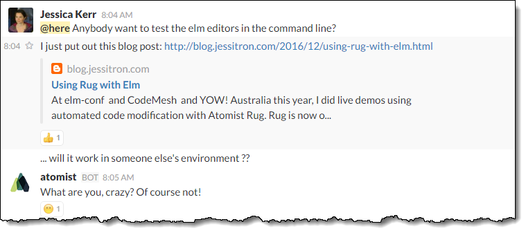

# This Month In Atomist - 2016 December

## News from the [Atomist Slack channels](https://atomist-community.slack.com)

### Kubernetes editor in development

Work continues on the K8 editor: https://github.com/atomist/rug/pull/15

### Using rug-cli with Proxies

https://atomist-community.slack.com/messages/rug-cli/ saw discussions around using Artifactory as a proxy to Central by configuring `cli.yml`

### Atomism of the day: Are you crazy?

