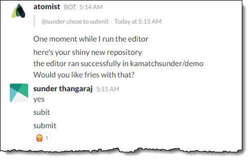
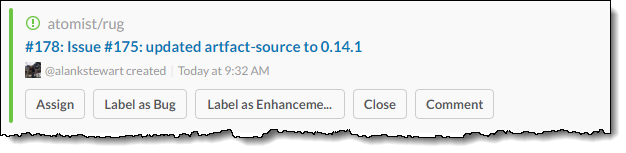
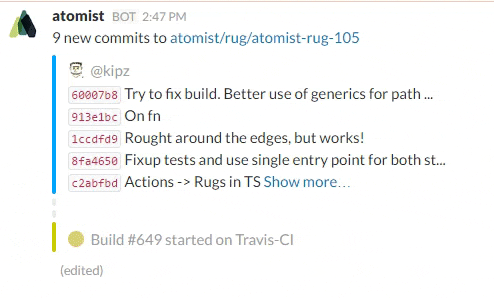
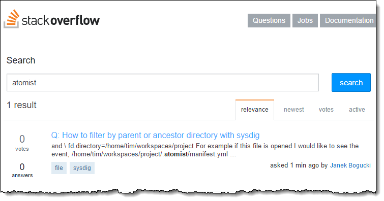

# This Month In Atomist - 2017 January

## News from the [Atomist Slack channels](https://atomist-community.slack.com)

### Interest in reducing copy and paste across composed editors

It's a sure herald of project maturity when "second-stage" requirements start to appear which has happened with this enhancement request related to making editor composition easier by collecting and processing parameters once: https://github.com/atomist/rug/issues/135 

### RugAAS

Mention of Rug-as-a-service as a route to supporting BitBucket and GitLab surfaced on this channel: https://atomist-community.slack.com/archives/general/p1483649226000196

_Button all the things!_

### Let's get interactive

Signs of an interactive mode for Rug editors appeared with this commit: https://github.com/atomist/rug-cli/compare/0c5cbebd9ded...299f7feb7918

     command_options+=( -I --interactive )

### @jessitron joins Atomist Team

Jessica Kerr joined the Atomist to a loud round of applause.

### Rug Syntax Highlighting Plugin for Atom waiting in the wings

Christian notes the existence of a not great Atom syntax plugin which nonetheless provides decent syntax highlighting: 
https://atomist-community.slack.com/archives/general/p1484121170000234

Release effort being reviewed by Mr D!

### Hunting the Formal Grammar for Rug

Thomas noted,
> I am thinking of writing an IntelliJ plugin for the Rug DSL

But things could be easier
> A formal definition of a language never hurts though

Backlogged! https://atomist-community.slack.com/archives/general/p1484216364000290

### Atomism of the day: If that's what you want that's what you'll get

### The Ever Increasing Pace of News: This Week In Atomist

Need a faster news cycle? Help out with the nascent *This Week In Atomist*
> https://atomist-community.slack.com/messages/thisweekinatomist/details/

### Deeper GitHub Integration

Integration with GitHub issues has started to appear in Slack along with options to release,

### Travis CI Slack Integration

Very cool!

### Completely Contrived Atomist StackOverflow post.

Almost as bad as product placement in summer blockbusters! Shameless!

http://stackoverflow.com/search?q=atomist
