## A full chatops session with Atomist

Extracted from https://atomist-community.slack.com/messages/mucon-demo/

### Project Creation

### Project Modification

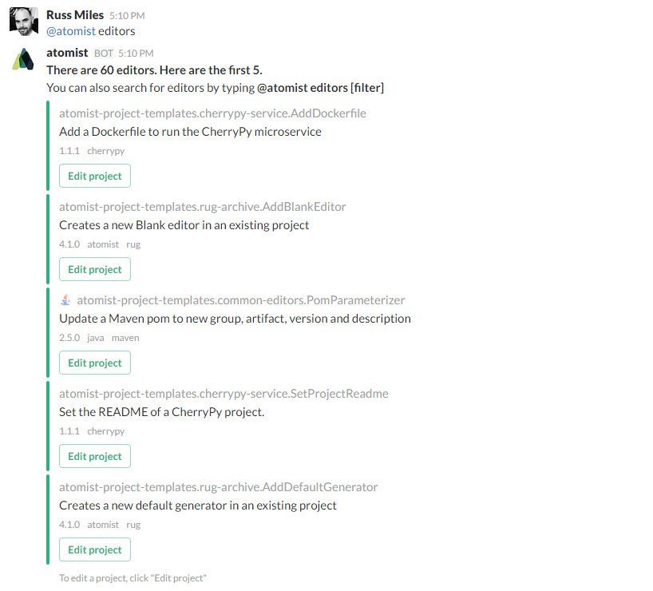

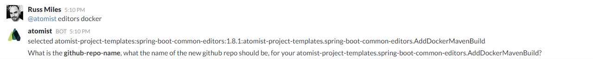

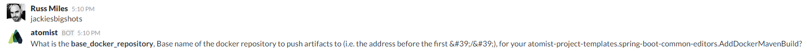

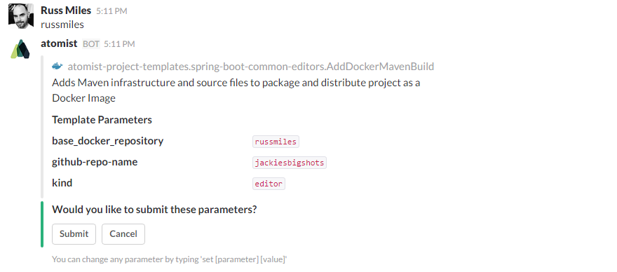

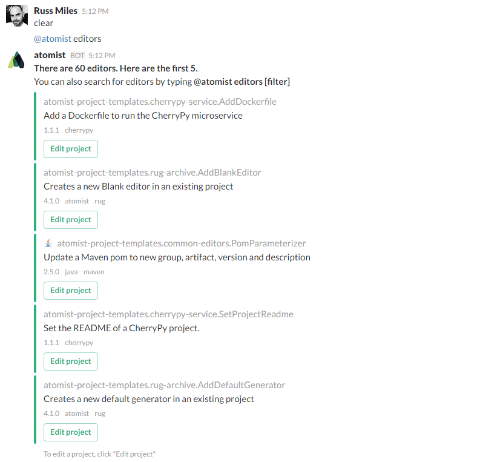

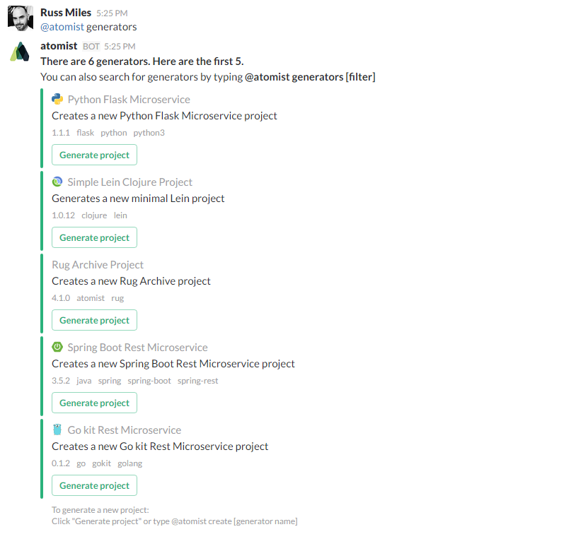

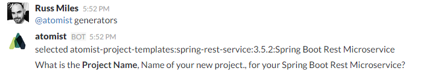

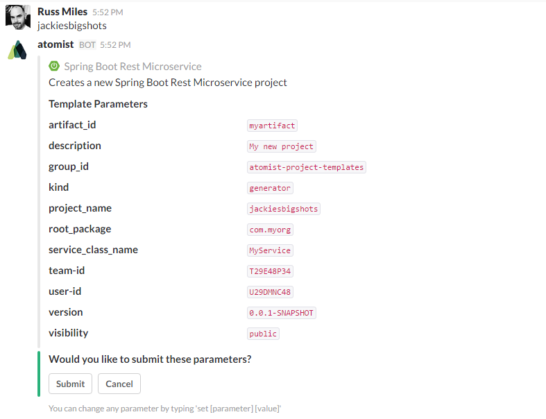

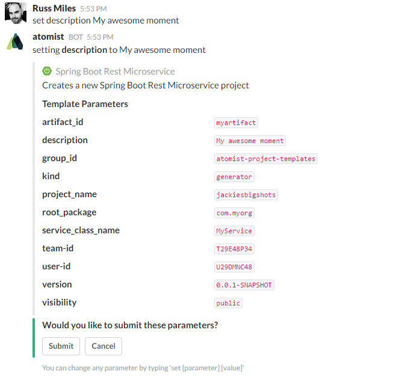

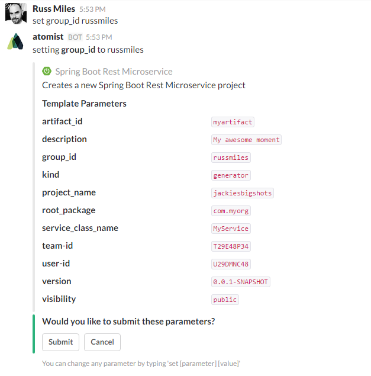

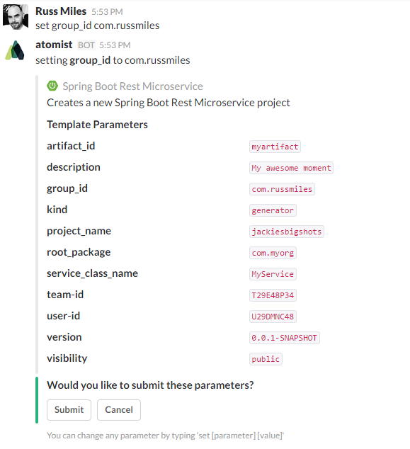

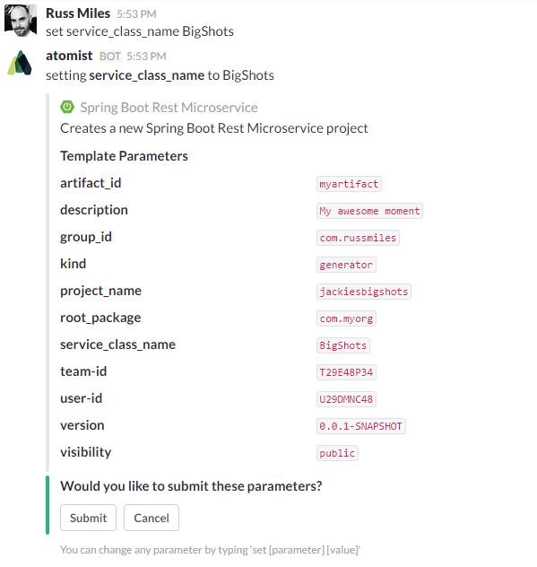

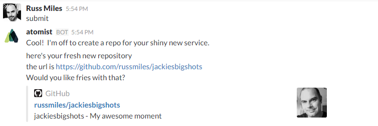

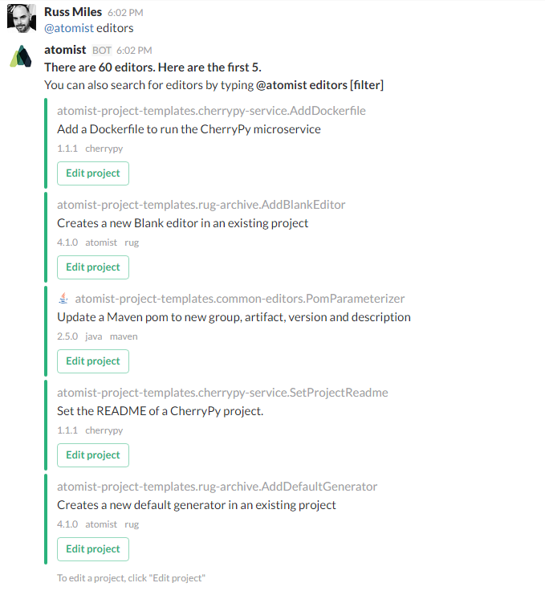

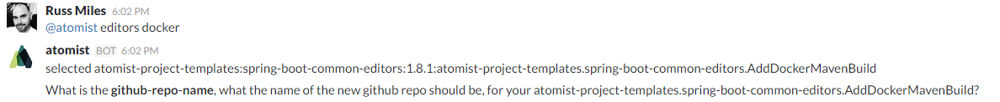

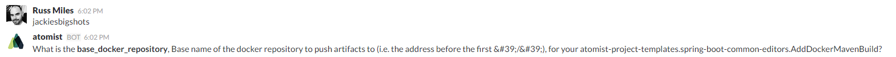

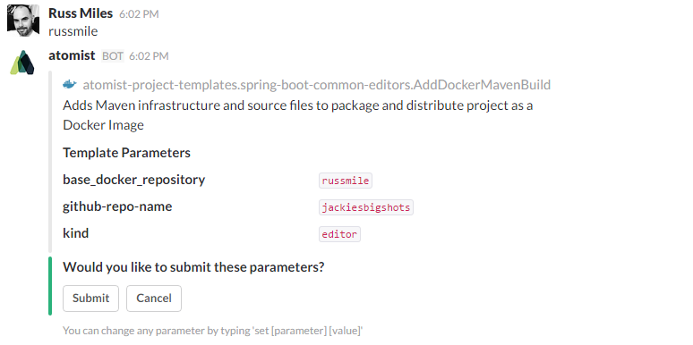

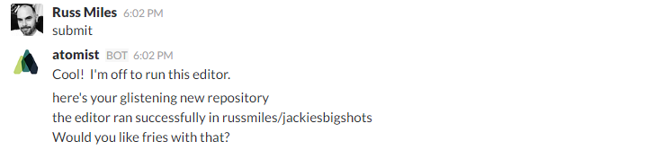

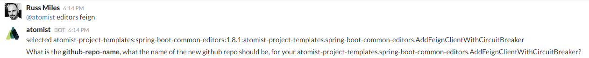

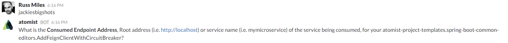

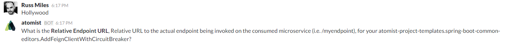

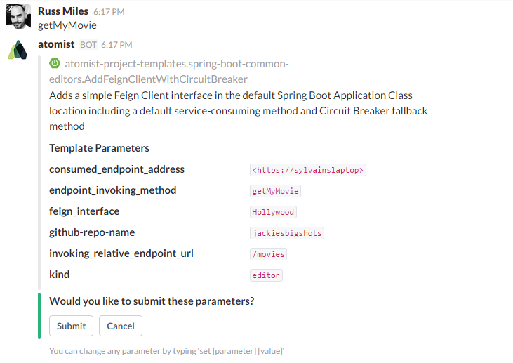

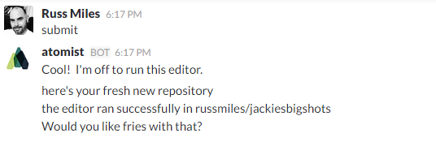

